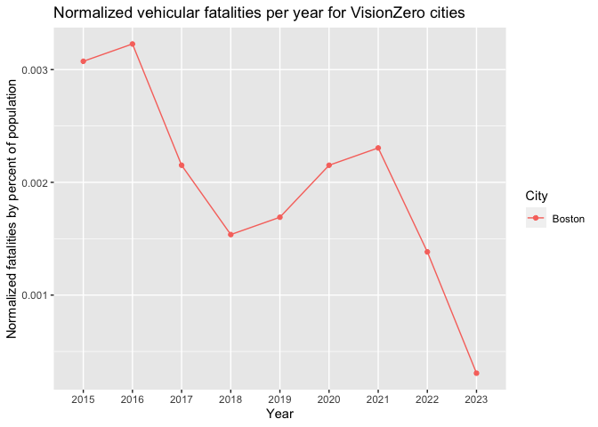
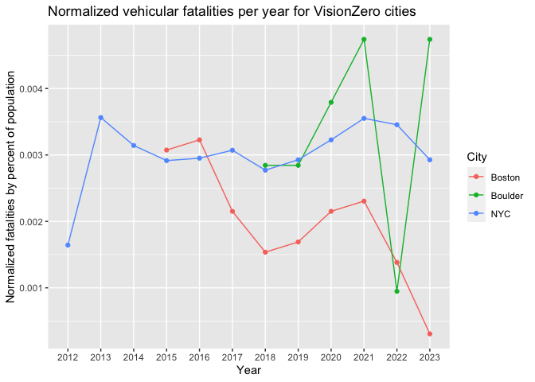

<!-- README.md is generated from README.Rmd. Please edit that file -->

# VisionZeroR

<!-- badges: start -->

[](https://github.com/kristine-le1/VisionZeroR/actions/workflows/R-CMD-check.yaml)
<!-- badges: end -->

The goal of VisionZeroR package is to consolidate and refine vehicle
fatality data from five cities recognized by VisionZero as of Fall
2023 - specifically, Boston, Richmond, Denver, Boulder, and NYC. This
package transforms the data into an accessible format for users.
Additionally, it includes a feature that allows plotting of vehicle
fatality rates, adjusted for population size, for any combination of
these five cities. This functionality is particularly useful for
analyzing and comparing the effectiveness of these cities in reducing
vehicle-related fatalities over time under the VisionZero initiative.

## Installation

You can install the development version of VisionZeroR from
[GitHub](https://github.com/) with:

``` r
#install.packages("devtools")
devtools::install_github("kristine-le1/VisionZeroR", force = TRUE)
```

## Example

This is a basic example which shows you how to solve a common problem:

``` r
library(VisionZeroR)
```

## VisionZero vehicular fatality data

The vehicular fatality and population data for the VisionZero cities
Boston, Richmond, Boulder, Denver, and NYC are aggregated into the
`vz_data_2023` data set.

``` r
head(vz_data_2023)
#> # A tibble: 6 × 5
#>   year  total_fatal city   pop_size fatal_perc
#>   <chr>       <int> <chr>     <dbl>      <dbl>
#> 1 2022            6 Denver   713252   0.000841
#> 2 2023            3 Denver   713252   0.000421
#> 3 2012          137 NYC     8335897   0.00164 
#> 4 2013          297 NYC     8335897   0.00356 
#> 5 2014          262 NYC     8335897   0.00314 
#> 6 2015          243 NYC     8335897   0.00292
```

In what year did each city have the most vehicular fatalities and how
many vehicular fatalities were there?

``` r
library(dplyr)
#> 
#> Attaching package: 'dplyr'
#> The following objects are masked from 'package:stats':
#> 
#>     filter, lag
#> The following objects are masked from 'package:base':
#> 
#>     intersect, setdiff, setequal, union
```

``` r

max <- vz_data_2023 |> 
    group_by(city) |> 
    summarise(max_fatalities = max(total_fatal))

edit_vz <- vz_data_2023 |> 
    select(1:3)

max_2 <- left_join(max, edit_vz, by = c("max_fatalities" = "total_fatal", "city" = "city"))
```

``` r

# Graph vehicular fatality data for just Boston
vz_graph("Boston")
```



``` r

# Graph vehicular fatality data for Boston, NYC, and Boulder
vz_graph(c("NYC", "Boston", "Boulder"))
```



You’ll still need to render `README.Rmd` regularly, to keep `README.md`
up-to-date. `devtools::build_readme()` is handy for this.

In that case, don’t forget to commit and push the resulting figure
files, so they display on GitHub and CRAN. In that case, don’t forget to
commit and push the resulting figure files, so they display on GitHub
and CRAN.
